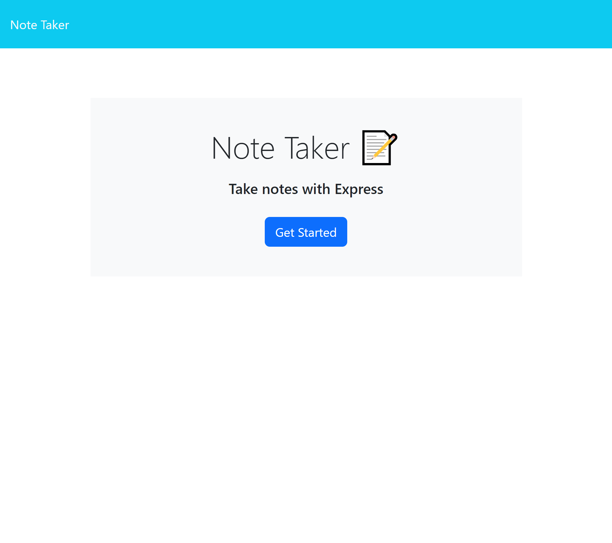

# Note Taker

## Description

This application takes notes/titles from user inputs and stores them. It can also delete those notes. This application was made to help users keep track of tasks, or whatever else they need.

## Table of Contents

[credits](#credits)

[license](#license)

[questions](#questions)

[contribution](#contributions)

## Installation

Download the note taker folder.

## Usage

After typing npm install, and then npm start, click on the local host url. Enter in notes as you wish.

## Credits

Edward Chang

## License

        This project is covered under the MIT license.

## Tests

N/A

## Contributions

N/A

## Questions

Email: boyofpopsicle@gmail.com

Github Profile Link: [ednihilator](https://www.github.com/ednihilator)
